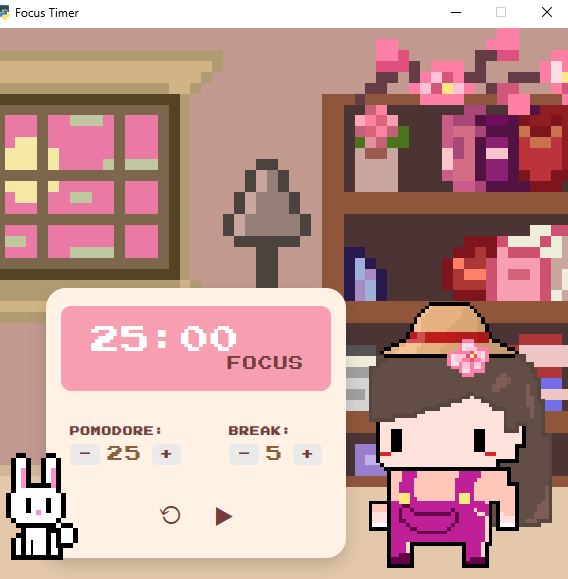

# Pixel-Study-Timer
A simple study timer desktop app using PyWebView, HTML/CSS/JS
Helps you stay focused using the Pomodoro technique with a cozy pixel-art aesthetic.

## Features
- Pomodoro-style study and break timers
- Customizable durations for study and break
- Pixel-art themed interface for a fun look
- Simple and intuitive user interface


 ## Screenshots

   

 ## Installation
1.Clone the repository:
```bash
git clone https://github.com/neginjoudi/Pixel-Study-Timer.git
```
2.Install dependencies:
```bash
pip install pywebview
```
3.Run the app:
```bash
python main.py
```

  


 
